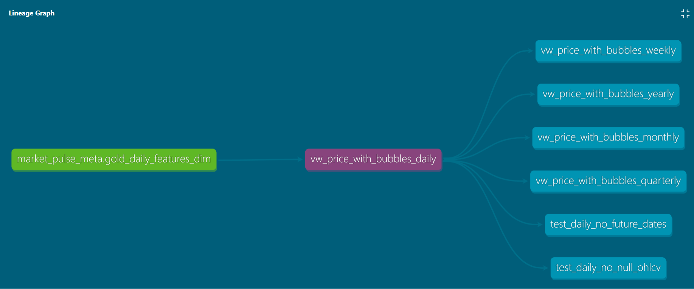

# Market Pulse - End-to-End Data Platform

Market Pulse is an end-to-end data engineering and analytics platform for financial market analysis, built on AWS with dbt and CI/CD.

The project focuses on ingesting, processing, and transforming intraday market data (stocks, ETFs) into analytics-ready datasets that support exploratory analysis and market regime research.

## High-level architecture

- **Ingest (Bronze)**
  Event-driven AWS Lambda workers fetch intraday OHLCV market data from an
  external data provider and store raw, immutable datasets in Amazon S3.

- **Silver**
  AWS Glue (Spark) jobs normalize, validate, deduplicate, and partition
  intraday datasets, preparing them for downstream analytical workloads.

- **Gold**
  Independent Glue workflows build higher-level aggregates, statistical features,
  and derived datasets optimized for analytical queries and signal research.

- **Analytics**
  Amazon Athena and Amazon QuickSight are used for exploratory analysis and BI,
  with dbt models providing a semantic and metrics layer on top of curated data.

## Analytical goals

Beyond building a reliable data platform, the project aims to support quantitative analysis of market behavior, including:

- Identification of potential **bubble formation signals**
- Detection of early **crash or regime-shift indicators**
- Systematic analysis of potentially **overvalued and undervalued symbols**

The goal is not direct price prediction, but the construction of robust, interpretable indicators that describe market structure and regime dynamics.

## Architecture Overview

The platform follows a cloud-native **Bronze / Silver / Gold** data lake architecture:

### Tech stack:
- **AWS Lambda** — ingestion
- **Amazon EventBridge** — scheduling
- **AWS Step Functions** — orchestration
- **Amazon S3** — data lake
- **AWS Glue (Spark)** — transformations
- **dbt (Athena)** — analytics & semantic layer
- **GitHub Actions** — CI/CD
- **Terraform** — infrastructure as code

## Data Pipeline

### Ingestion (Bronze)
- Event-driven Lambda workers fetch OHLCV market data from Alpha Vantage  
- Raw, immutable datasets are stored in Amazon S3

### Processing (Silver)
- AWS Glue jobs normalize, validate, deduplicate, and partition data  
- Data is prepared for analytical workloads

### Feature Layer (Gold)
- Glue workflows generate:
  - aggregates
  - statistical features
  - derived indicators

  ## Analytics Layer (dbt)

dbt builds a semantic layer on top of curated datasets:

- Daily OHLCV dataset enriched with engineered features
- Bubble/crash regime detection
- Multi-level aggregations:
  - weekly
  - monthly
  - quarterly
  - yearly

  ## Data Lineage

## Data Quality

Data quality is enforced using dbt tests:

- **Grain validation**
  - `(symbol, trade_date)` uniqueness

- **Domain validation**
  - `regime_label ∈ {bubble, crash, normal}`

- **Range validation**
  - `bubble_score ∈ [0, 100]`

- **Custom checks**
  - no future dates
  - no null OHLCV values

## CI/CD

- Lambda artifacts built and uploaded to S3
- Infrastructure deployed via Terraform
- dbt models executed and tested via GitHub Actions
- Documentation generated automatically

## Design Principles

- Separation of concerns:
  - ingestion vs processing vs analytics
- Event-driven orchestration (EventBridge + Step Functions)
- dbt as a semantic layer, not ETL replacement
- Reproducibility via Terraform and CI/CD
- Environment isolation (dev vs legacy datasets)

## Output

The platform produces analytics-ready datasets designed for market analysis, including:

- Daily enriched OHLCV data with engineered features
- Bubble/crash regime classification signals
- Aggregated views (weekly, monthly, quarterly, yearly)
- Feature-driven datasets for exploratory and quantitative analysis

## Future Improvements

- Implementation of incremental dbt models for improved performance and cost efficiency
- Hosting dbt documentation for easier data discovery and lineage exploration
- Development of BI dashboards for market regime monitoring and exploratory analysis

